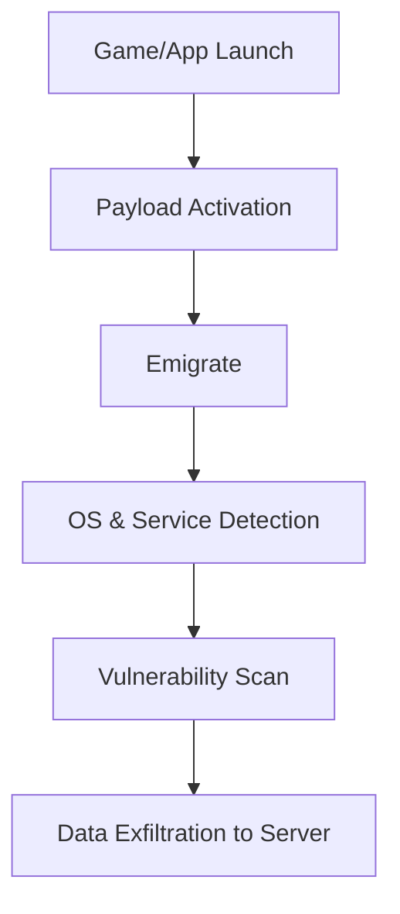

# ⚠️ PhantomStrike ⚠️

> **DISCLAIMER**  
This tool is created **strictly for educational, academic, and research purposes**. It must **never be deployed outside legal, controlled test environments** such as CTFs, isolated sandboxes, or ethical hacking labs. **Unauthorized use is illegal.**  

**Authors:** Adeline Eminian, Andranik Adyan  
**Date:** April 12, 2025  
**Classification:** Educational | Red Team | Blue Team | Research Use Only

---

## 📖 Overview

**PhantomStrike** is a cross-platform payload delivery framework designed to test system defenses against advanced persistent threat (APT)-style techniques. It simulates real-world attack vectors using vulnerability scanning, reverse shells, anti-forensics, and obfuscation methods — deployed through a Trojanized game or application.

---

## 🚀 Features

- 🔥 Cross-platform support: **Windows, Linux, macOS**
- 🛠️ Vulnerability scanning module targeting open ports, services, and kernel CVEs
- 🐚 Reverse shell capability
- 🎮 Game-based obfuscation and dual-thread payload delivery
- 🎭 Anti-forensics techniques to minimize forensic artifacts
- 📦 Obfuscation methods:
  - String encryption
  - Binary packing
  - Variable name obfuscation
  - Anti-VM and sandbox detection

---

## 🖥️ System Architecture


---

## ⚙️ Installation & Setup

Ensure these are installed in your sandboxed environment only.

- nmap for vulnerability scanning

- msfconsole (Metasploit Framework) for optional exploitation modules

- Python 3.x (if using Python-based payloads)

- pip for installing Python libraries (if applicable)

- Wireshark, netstat, Ghidra for monitoring and analysis

## 🔧 Install on Linux/macOS

```bash
  sudo apt update && sudo apt install -y nmap metasploit-framework wireshark
  sudo pip3 install -r requirements.txt
```

## 🖥️ Install on Windows (inside Windows Sandbox / VM)

- Install nmap via the official installer: https://nmap.org/download.html

- Install Metasploit: https://docs.metasploit.com/docs/using-metasploit/getting-started/nightly-installers.html

- Install Python 3.x from https://www.python.org/downloads/windows/

- Install Wireshark

## 📂 Running the Clean Code

```bash
  cd obfuscated
  python3 client.py
```

## 🔍 Vulnerability Scanning Module
- Tools/APIs Used:

  - nmap

  - CVE libraries

  - Optional msfconsole integration

- Targets:

  - Open ports

  - Outdated services

  - Kernel vulnerabilities

  - Misconfigurations

- Output: JSON and database storage

- Data Transfer: Encrypted socket communication

## 🔍 Detection & Countermeasures
- Detection Results: Tested against VirusTotal and EDR solutions

- EDR Evasion Techniques: Custom string encoding, in-memory execution

- Recommendations for Blue Teams:

  - Monitor dual-thread processes

  - Detect anomalous in-memory binaries

  - Analyze unusual network traffic patterns

  - Detect reflective DLL loading or fileless execution

